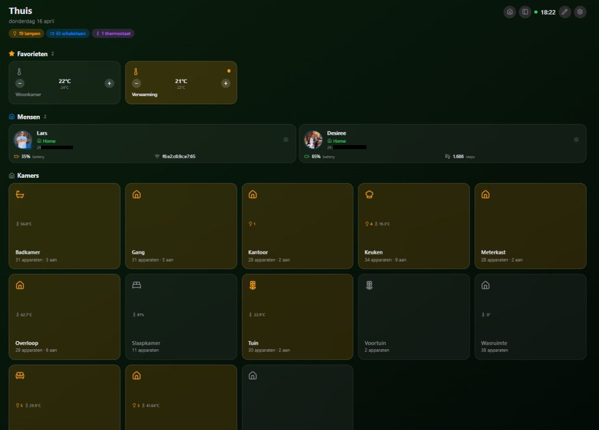
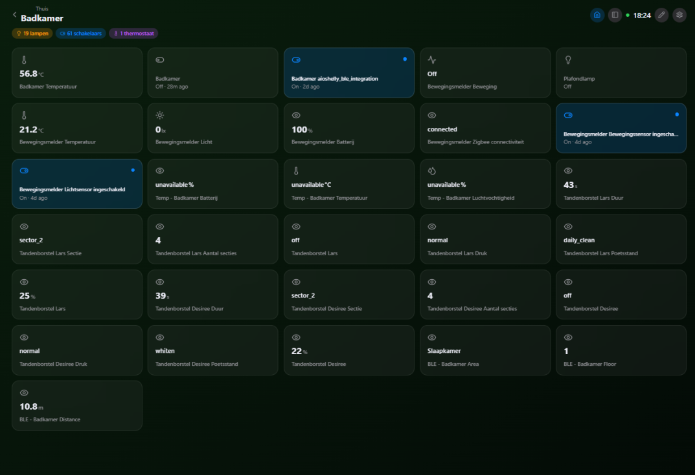
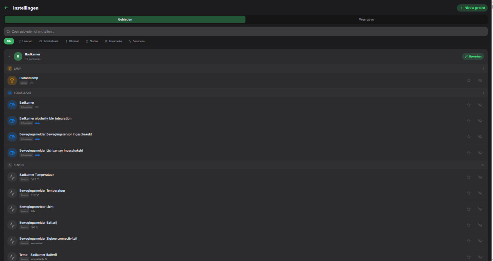
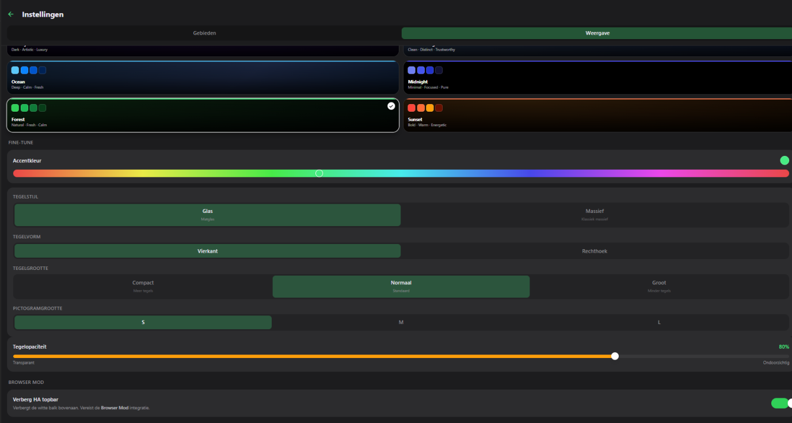

> **⚠️ AI Hobby Project — Work in Progress**
> Built with Claude AI. Actively under development — expect changes and occasional rough edges.

---

# The-One Dashboard

A HomeKit-style Home Assistant dashboard add-on. Glassmorphism tiles, area-based rooms, color light controls, per-user settings, and real-time WebSocket updates — no configuration needed.

---

## Screenshots









---

## Features

- **HomeKit-style tiles** — light, switch, thermostat, lock, cover, sensor, scene, automation, script, media player, camera, calendar, person
- **Glassmorphism UI** — frosted glass tiles with customisable accent colour and backgrounds
- **Edit mode** — resize, reorder, hide/show tiles, custom icons, drag-to-reorder
- **Color lights** — HSV wheel, color temperature, brightness, presets, light groups
- **Real-time updates** — WebSocket state sync, optimistic UI
- **Per-user settings** — favorites, hidden entities, custom names, icon overrides — synced across devices
- **Sidebar** — clock, greeting, weather, active device counts, notifications, quick navigation
- **Person cards** — zone, linked sensors (battery, WiFi, steps, Spotify, geocoded address)
- **12 languages** — auto-detected from HA language setting
- **Zero config** — auto-connects via HA Supervisor token

---

## Installation

1. Go to **Settings → Add-ons → Add-on Store** in Home Assistant
2. Click **⋮** → **Repositories** → add:
   ```
   https://github.com/larsoss/the-onedashboard
   ```
3. Find **The-One Dashboard** → **Install** → **Start**
4. The dashboard appears in your HA sidebar automatically

---

## Tile Types

| Tile | Interaction |
|------|-------------|
| **Light** | Tap toggle · Long-press brightness · Tap color dialog (HSV, CT, presets) |
| **Switch / Input Boolean** | Tap toggle |
| **Thermostat / Climate** | Tap → temp +/– dialog + mode selector |
| **Lock** | Tap → confirm unlock · instant lock |
| **Cover / Blind** | Tap open/close · Long-press position slider |
| **Sensor / Binary Sensor** | Read-only with device-class icon |
| **Scene** | Tap to activate |
| **Automation** | Toggle enabled · Trigger button |
| **Script** | Tap to run · spinner while executing |
| **Weather** | Current conditions + 3-day forecast |
| **Media Player** | Album art · Play/pause/skip · Volume · Shuffle/repeat |
| **Camera** | Live snapshot (10 s refresh) · Tap → full-screen stream |
| **Calendar** | Next event · Tap → 7-day modal |
| **Person** | Zone · linked sensors · Spotify |

---

## Full Documentation

See [`the_one_dashboard/README.md`](the_one_dashboard/README.md) for the complete user guide: Edit Mode, Settings, Sidebar, URL parameters, and development setup.

See [`the_one_dashboard/CHANGELOG.md`](the_one_dashboard/CHANGELOG.md) for version history.
